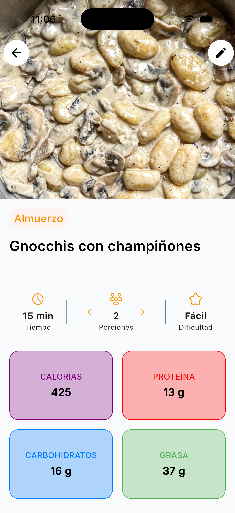
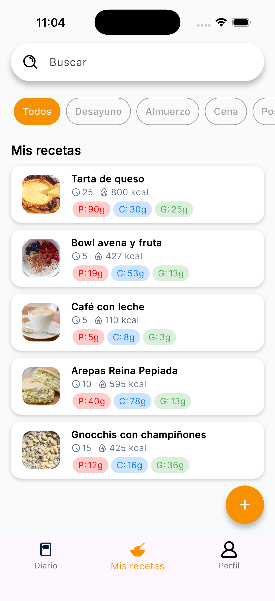
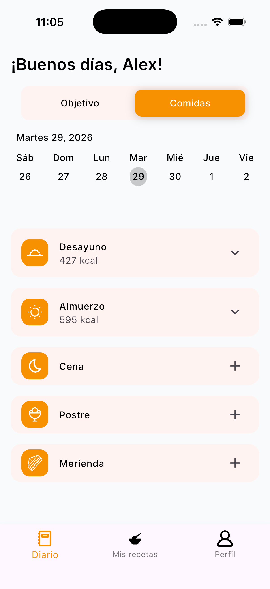
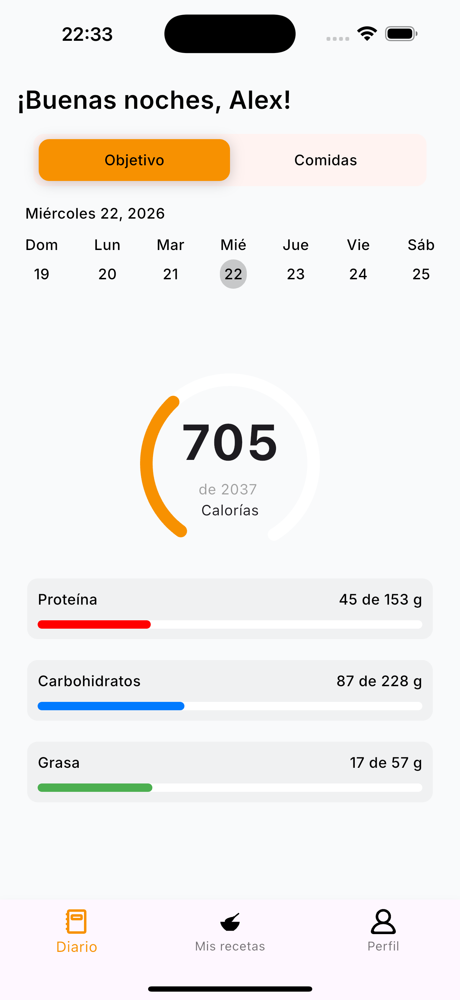
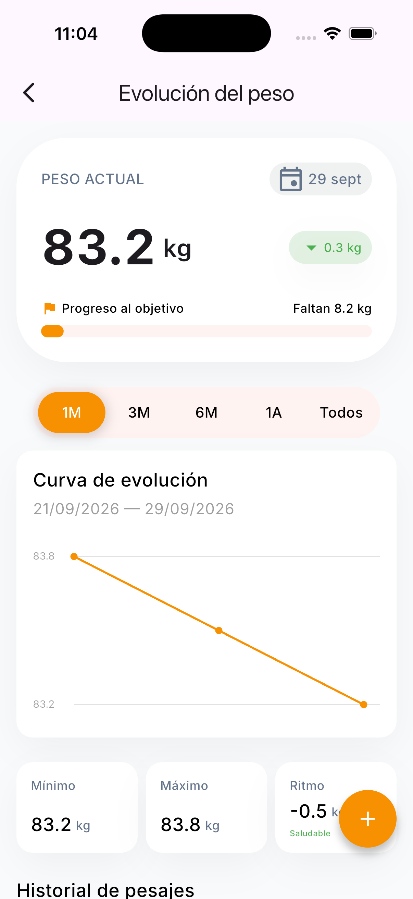
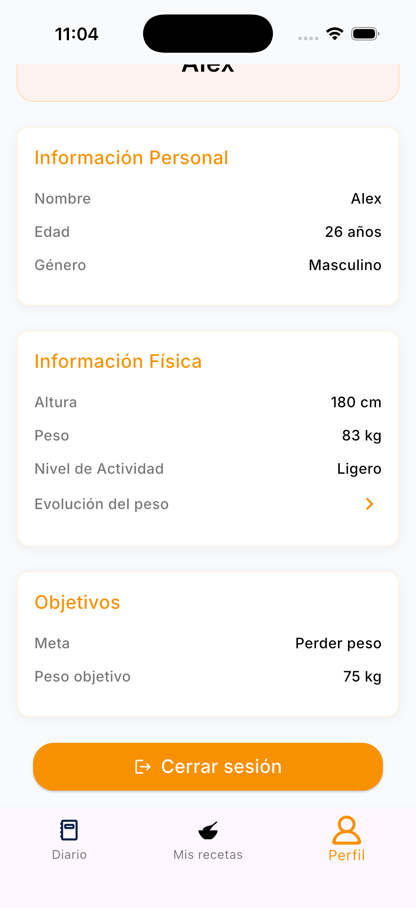

# Cook Note

A Flutter mobile application for recipe management, nutrition profile tracking, and daily food journaling.  
The project follows a feature-based modular structure to keep it scalable, maintainable, and easy to evolve.

## Screenshots

### Recipes

| Recipe details | Recipes list |
| :---: | :---: |
|  |  |

### Food diary

| Diary | Macros | Weight |
| :---: | :---: | :---: |
|  |  |  |

### Profile

| Profile |
| :---: |
|  |

## Project Architecture

The app is organized with clear separation of responsibilities:

- **config**: global configuration (`router`, `theme`, `env`).
- **core**: shared models, reusable services, utilities, enums, and base blocs.
- **data**: concrete local and remote persistence implementations.
- **features**: business modules (login, home, recipes, diary, profile, etc.).
- **pages/widgets**: screen composition and reusable UI components.

## Main Technologies

- **Framework**: `Flutter`
- **State Management**: `flutter_bloc`
- **Routing**: `go_router`
- **Backend**: `supabase_flutter`
- **Local Storage**: `hive_flutter`
- **AI Integration**: `flutter_gemini` (macro/nutrition support service)
- **Internationalization**: `easy_localization` (currently configured for `es`)
- **UI**: `google_fonts`, `flutter_svg`, custom widgets

## Current Features

- **Authentication**: login, registration, and password recovery.
- **Recipes**:
  - recipe listing
  - recipe creation and editing
  - recipe details view (ingredients, steps, macros, difficulty, occasion)
- **Recent Recipes**: local storage and retrieval of recently viewed recipes.
- **Nutrition Diary**: daily meal and objective tracking.
- **Weight Tracking** (`lib/features/weight/`):
  - manual weight entries (kg and date, one record per day)
  - evolution chart with range selector (1 month / 3 months / 6 months / 1 year / all), rendered with a custom painter (no chart dependencies)
  - current weight, min/max and weekly loss rate with a "healthy / too fast" rating
  - progress towards the target weight stored in the profile
  - full weigh-in history with the delta against the previous record
  - data persisted in Supabase (`weight_records`, RLS scoped per user)
- **User Profile**: profile visualization and editing.

## Folder Structure

```text
lib/
├── config/
│   ├── env/                   # Environment constants/config
│   ├── router/                # GoRouter setup and routes
│   └── theme/                 # Colors, styles, and global theme
├── core/
│   ├── blocs/                 # Shared blocs (e.g., user state)
│   ├── enums/
│   ├── extensions/
│   ├── models/                # Base app models/entities
│   ├── services/              # Shared services (e.g., AI macros)
│   └── utils/
├── data/
│   ├── hive/                  # Local repositories/cache
│   └── supabase/              # Remote repositories
├── features/
│   ├── login/
│   ├── home/
│   ├── my_recipes/
│   ├── recent_recipes/
│   ├── recipe/
│   ├── create_edit_recipe/
│   ├── diary/
│   ├── profile/
│   ├── edit_profile/
│   └── weight/
├── pages/                     # Main screen pages
├── widgets/                   # Reusable UI widgets
├── main.dart                  # Entry point
└── main_app.dart              # Initial app state bootstrapping
```
